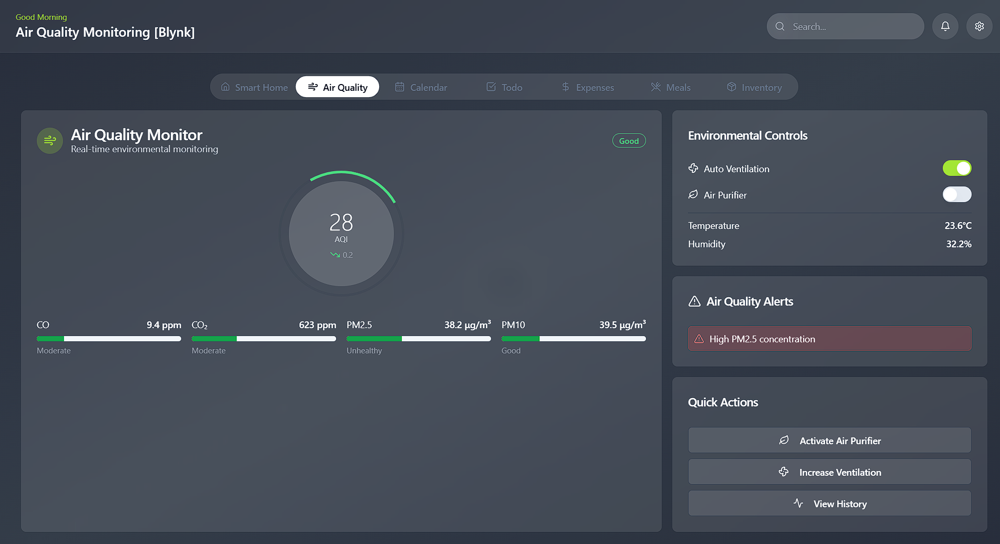
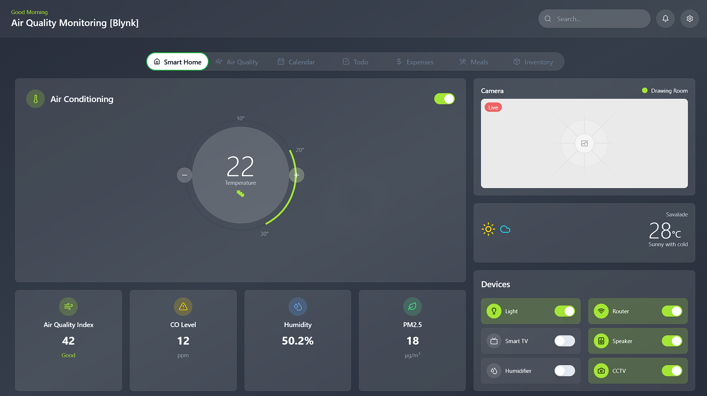
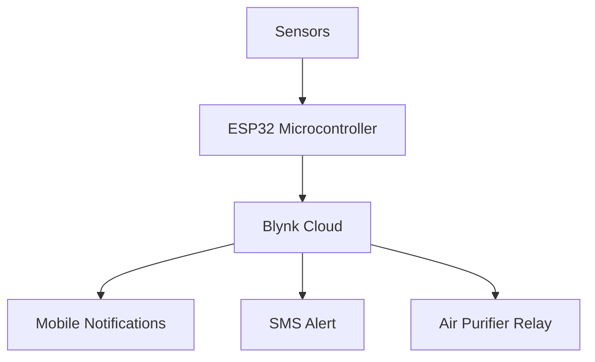
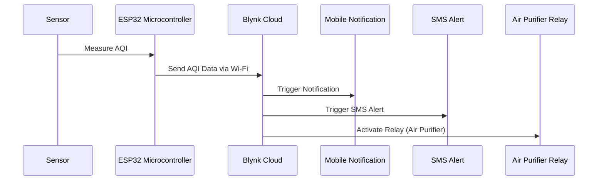

# 🍃 Air Quality Sensoring IoT Project

> A smart IoT system that monitors Air Quality Index (AQI) and performs intelligent automation like switching on an air purifier, sending SMS or app notifications through Blynk when thresholds are breached — making indoor air healthier and smarter.

---
### 🖥️ Dashboard Screens

  
<!--    -->

---

### 📲 Mobile Notification Demo

  

---

## 📖 Table of Contents

- [Overview](#-overview)
- [Features](#-features)
- [System Architecture](#-system-architecture)
- [System Design](#-system-design)
- [Technology Stack](#-technology-stack)
- [Folder Structure](#-folder-structure)
- [Screenshots](#-screenshots)
- [How It Works](#-how-it-works)
- [License](#-license)

---

## 🧠 Overview

This project uses sensor data to track real-time AQI and executes automated routines (like turning on an air purifier) when certain environmental thresholds are crossed. The entire system is integrated with the **Blynk IoT platform** for sending **real-time alerts** via push notifications and SMS.

---

## ✨ Features

- 🧪 Real-time AQI Monitoring via Sensors
- ⚙️ Automated Air Purifier Control
- 📲 Notification & SMS via Blynk
- 🌐 Firebase for Realtime Data Syncing
- 🖼️ Clean, component-driven UI (Next.js + Tailwind CSS)
- 📡 MQTT/Blynk Protocol Integration

---

## 🏗️ System Architecture

- **ESP32** reads AQI sensor data (like MQ135 or PMS5003).
- Sends data to **Blynk Cloud** over Wi-Fi.
- Triggers automation (e.g., relay for air purifier).
- Sends **notifications/SMS** based on threshold logic.

---

## 🧩 System Design

- **Frontend**: Built with Next.js (App Router), styled using Tailwind CSS.
- **Backend Logic**: AQI threshold logic handled in ESP32 + Firebase Functions (optional).
- **Communication**: Blynk App (via HTTP/WebSockets).
- **Notifications**: App push or SMS using Blynk triggers.
- **Data Handling**: Uses Firebase if persistence needed.

---

## 🛠️ Technology Stack

| Layer            | Tech/Platform          |
|------------------|------------------------|
| Frontend         | Next.js 14, Tailwind CSS |
| Language         | TypeScript             |
| IoT Controller   | ESP32                  |
| IoT Platform     | Blynk IoT              |
| Messaging        | Blynk Notifications, SMS |
| Cloud Realtime DB| Firebase (Firestore)   |
| Styling          | Tailwind CSS           |
| Dev Tools        | ESLint, Prettier       |
---

## ⚙️ How It Works

1. The AQI sensor measures air quality in real time.
2. Data is sent via ESP32 to Blynk over Wi-Fi.
3. If AQI is above a defined threshold:
   - Relay triggers the air purifier.
   - Blynk sends SMS and notification alerts.
4. UI displays live data and system status.

---

## Work-Flow

## 📄 License

This project is licensed under the [GNU Affero General Public License v3.0](https://www.gnu.org/licenses/agpl-3.0.html).

---
> Made using code, sensors, and care for cleaner air.
